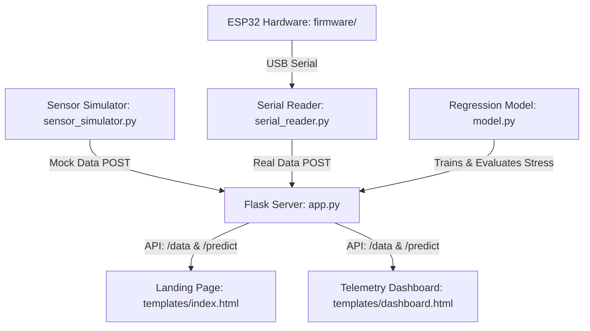

# Nirvana | Real-Time Somatic Analysis & Academic Stress Monitoring

Nirvana is an advanced, clinical-grade telemetry and predictive stress monitoring platform designed for academic high-performance. Operating over a dual-interface architecture, Nirvana connects a physical (or virtual) biometric sensor suite to an intelligent machine learning regression model to track, evaluate, and predict academic strain and circadian stability.

---

## Design System & Ice-Cyan Theme

Nirvana features a bespoke, premium visual identity tailored for surgical clarity and a highly polished user experience:

- **Minimalist Light-Themed Landing Page (templates/index.html)**: Serves as a crisp, spacious entrance built on a pure white backdrop (`#ffffff`). It features an interactive typewriter terminal and an elegant, custom staggered vertical scroll-linked pop-up wave entrance for the central title **NIRVANA**.
- **High-End Dark-Themed Live Dashboard (templates/dashboard.html)**: Delivers a deep space-black canvas (`#080c14` to `#0c1424`) with glassmorphic cards carrying soft cyan drop-shadows and ice-cyan borders.
- **Ice-Cyan Color Token Scale**:
  - `#E0F7FA` (Ultra-light Ice Cyan)
  - `#B2EBF2` (Pastel Light Cyan)
  - `#80DEEA` (Medium Cool Cyan Accent)
  - `#4DD0E1` (Vibrant Technical Cyan Core)
  - `#26C6DA` (Deep Sky Cyan Highlight)
- **Clinical Aesthetics (Zero-Emoji Policy)**: Standard decorative text emojis are completely forbidden in both frontend markup and backend logs. Icons are rendered using crisp, high-fidelity SVGs or FontAwesome vector outlines.
- **Premium Typography**: Headings are set in the sharp, technical **Space Grotesk** typeface, while body copies flow naturally in readable **Outfit** typography.

---

## Architecture & Core Components



- **`app.py`**: The central Flask backend server orchestrating somatic API requests, serves pages, and runs real-time stress index evaluation routes.
- **`model.py`**: Trains a linear regression model based on historical heart rate (BPM), movement actigraphy (Hz), and ambient lux levels to assess sleep disturbances.
- **`serial_reader.py`**: Reads real sensor telemetry from ESP32 via USB serial port, parses it, and forwards it to the Flask server in real-time.
- **`sensor_simulator.py`**: Simulates the physical telemetry suite and streams active metrics frame-by-frame to the Flask server via HTTP POST requests.
- **`firmware/`**: Arduino source code (`esp32_firmware.ino`) and wiring diagrams for the physical ESP32 hardware device.
- **`plot_data.py`**: A convenient analytical plotting utility for offline diagnostic runs.

---

## Directory Structure

```
nirvana_idp/
├── .env.template          # API key placeholder
├── .gitignore             # Git ignore rules
├── README.md              # Setup & usage docs
├── requirements.txt       # Python dependencies (Flask, pandas, scikit-learn, etc.)
├── app.py                 # Flask server (routes, background simulator, Gemini chat)
├── model.py               # ML model training script
├── sensor_simulator.py    # Software-only telemetry simulator (API poster)
├── serial_reader.py       # ESP32 USB serial reader (real hardware mode)
├── plot_data.py           # Offline diagnostic chart plotter
├── firmware/
│   ├── README.md          # Hardware wiring & flash instructions
│   └── esp32_firmware/
│       └── esp32_firmware.ino  # Arduino sketch for ESP32
└── templates/
    ├── index.html         # Landing page (light theme, scroll animations)
    └── dashboard.html     # Live telemetry dashboard (dark theme, glassmorphic)
```

---

## Getting Started

### 1. Prerequisites
Ensure you have Python 3.8+ installed along with the required libraries:
```bash
pip install -r requirements.txt
```

### 2. Train the Predictive Model
Initialize the machine learning weights before starting:
```bash
python model.py
```

### 3. Launch the Flask Server
Run the backend web app in a terminal window:
```bash
python app.py
```

### 4. Feed Telemetry Stream (Choose One Option)

#### Option A: Software Simulation
Generate virtual biometric data and send it to the Flask server:
```bash
python sensor_simulator.py
```

#### Option B: Real ESP32 Hardware
1. Flash the firmware from the `firmware/esp32_firmware/` directory to your ESP32.
2. Wire up the sensors as described in `firmware/README.md`.
3. Connect the ESP32 to your PC via USB.
4. Run the serial reader script (will auto-detect the COM port):
   ```bash
   python serial_reader.py
   ```

### 5. Access Dashboard
Open [http://127.0.0.1:5000](http://127.0.0.1:5000) in your browser to experience the platform.
