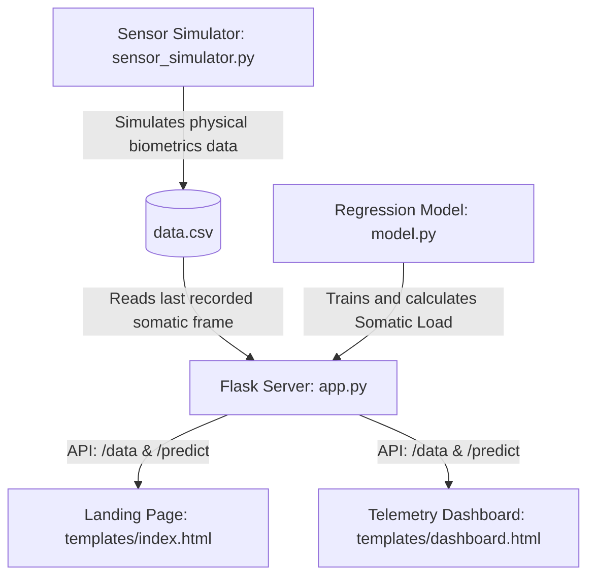

# Nirvana | Real-Time Somatic Analysis & Academic Stress Monitoring

Nirvana is an advanced, clinical-grade telemetry and predictive stress monitoring platform designed for academic high-performance. Operating over a dual-interface architecture, Nirvana connects a physical (or virtual) biometric sensor suite to an intelligent machine learning regression model to track, evaluate, and predict academic strain and circadian stability.

---

## 🎨 Design System & Ice-Cyan Theme

Nirvana features a bespoke, premium visual identity tailored for surgical clarity and a highly polished user experience:

- **Minimalist Light-Themed Landing Page (`index.html`)**: Serves as a crisp, spacious entrance built on a pure white backdrop (`#ffffff`). It features an interactive typewriter terminal and an elegant, custom staggered vertical scroll-linked pop-up wave entrance for the central title **NIRVANA**.
- **High-End Dark-Themed Live Dashboard (`dashboard.html`)**: Delivers a deep space-black canvas (`#080c14` to `#0c1424`) with glassmorphic cards carrying soft cyan drop-shadows and ice-cyan borders.
- **Ice-Cyan Color Token Scale**:
  - `#E0F7FA` (Ultra-light Ice Cyan)
  - `#B2EBF2` (Pastel Light Cyan)
  - `#80DEEA` (Medium Cool Cyan Accent)
  - `#4DD0E1` (Vibrant Technical Cyan Core)
  - `#26C6DA` (Deep Sky Cyan Highlight)
- **Clinical Aesthetics (Zero-Emoji Policy)**: Standard decorative text emojis are completely forbidden in both frontend markup and backend logs. Icons are rendered using crisp, high-fidelity SVGs or FontAwesome vector outlines.
- **Premium Typography**: Headings are set in the sharp, technical **Space Grotesk** typeface, while body copies flow naturally in readable **Outfit** typography.

---

## 🛠️ Architecture & Core Components



- **`app.py`**: The central Flask backend server orchestrating somatic API requests, serves pages, and runs real-time stress index evaluation routes.
- **`model.py`**: Trains a linear regression model based on historical heart rate (BPM), movement actigraphy (Hz), and ambient lux levels to assess sleep disturbances.
- **`sensor_simulator.py`**: Simulates the physical telemetry suite (MAX30102 Cardio, MPU6050 Accelerometer, LDR Ambient Sensor) and streams active metrics frame-by-frame.
- **`plot_data.py`**: A convenient analytical plotting utility for offline diagnostic runs.

---

## 🚀 Getting Started

### 1. Prerequisites
Ensure you have Python 3.8+ installed along with the required libraries:
```bash
pip install flask pandas numpy scikit-learn matplotlib
```

### 2. Start the Telemetry Sensor Simulator
The simulator writes virtual biometric frames to `data.csv` every 2 seconds:
```bash
python sensor_simulator.py
```

### 3. Launch the Flask Server
Run the backend web app in a separate terminal:
```bash
python app.py
```
Open [http://127.0.0.1:5000](http://127.0.0.1:5000) in your browser to experience the platform.

---

## 📚 Documentation
For deeper technical designs and transition history:
- [Technical Walkthrough](walkthrough.md): Learn about the cinematic staggered vertical scroll letter pop-up, palettes, and visual synchronization.
- [Technical Implementation Plan](implementation_plan.md): Review route breakdowns, stress models, and the scientific 5-Tier physiological stress index.
